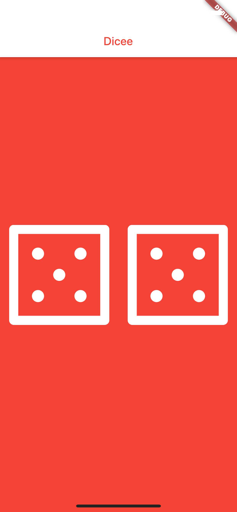

# Dicee 🎲

You can make the die roll at the press of a button. With this app in your pocket, you’ll be able to settle any score on the go!

## Things have done

- Use of Flutter stateless widgets to design the user interface.
- Use of Flutter stateful widgets to update the user interface.
- Change the properties of various widgets.
- Use of onPressed listeners to detect when buttons are pressed.
- Use of setState to mark the widget tree as dirty and requiring update on the next render.
- Use of Expanded to make widgets adapt to screen dimensions.
- Understand and use of string interpolation.
- Learn about basic dart programming concepts such as data types and functions.
- Code and use gesture controls.